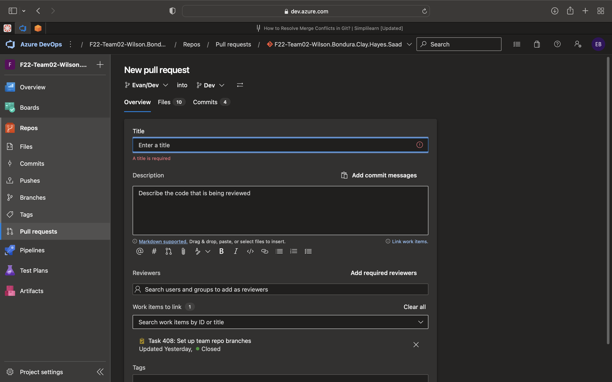

# Introduction

MAZED Team Good Driver Rewards Program for CPSC4910

# Technologies

Frontend: AngularJS, Bootstrap, Angular Material
Backend: ASP.NET Web API's, C#
<<<<<<< HEAD
=======
<<<<<<< HEAD
>>>>>>> origin/Madison/Dev
Database: AWS RDS

# Committing

<<<<<<< HEAD
1. I am big believer of committing early and often, that way if something goes wrong in your code, it is easy to revert to a stable commit and pinpoint the error.
2. To commit your changes in Visual Studio Code:
   1. First, make sure your repo is connected the Azure branches and that you are in the correct branch
      1. DO NOT COMMIT TO MAIN!!!!!!
   2. Second, select the Source Control tab on the left-hand menu
      1. Icon looks like this 
   3. Second, select the Source Control tab on the left-hand menu
   4. In this view, you should be able to see all of your changes since your last commit
      
=======
1. I am big believer of committing early and often, that way if something goes wrong in your code, it is easy to revert to a stable commit and pinpoint the error. 
2. To commit your changes in Visual Studio Code:
   1. First, make sure your repo is connected to the Azure branches and that you are in the correct branch
      1. DO NOT COMMIT TO MAIN!!!!!!
   2. Second, select the Source Control tab on the left-hand menu 
   3. In this view, you should be able to see all of your changes since your last commit
       
>>>>>>> origin/Madison/Dev
      1. Hover over the desired file to stage and a `+` should appear
      2. Click the plus button to stage the change
         1. This means you intentionally select what changes to apply (like me staging this readme)
      3. Once you have staged all your files, hit commit!
         1. This only actually updates your branch locally, not online, so to get the changes into your Azure branch we have to push your changes.....
<<<<<<< HEAD

### NOTE: Make sure your commits have meaningful commit messages. This is so that when other teammates look at your branches/commits, they will be able to quickly pick up what exactly each commit achieved.

# Pushing and Pulling

### Pushing your changes

1.  Once you have made a commit, you will see a down arrow and an up arrow. These represent the number of incoming commits (from other teammates) and outgoing commits (made by you), respectively. They also allow other to incrementally see the changes you have made.
2.  As seen in the picture, I have one outgoing commit that I need to push onto the online branch so that is visible to everyone else.
3.  In VSCode, there are two easy ways to do this:
    1. Click on the three dots in the Source Control pane (See previous image) where dropdown menu will appear for you to select push, OR
    2. Click on the up/down arrows themselves. This action will also pull changes from your branch as well.
4.  It is up to you when push your changes, as long as you commit regularly.

### Pulling changes

1.  Pulling is when you bring a teammate's changes/commits into your own branch, updating the code.
2.  When to pull:
    1. When you are working with another teammate in the same branch.
       1. Pull often to avoid stepping on each other's code
    2. When you are starting to work a new feature/branch
       1. Always pull from main if you are doing this (will be explained again in branch protocols)
=======
### NOTE: Make sure your commits have meaningful commit messages. This is so that when other teammates look at your branches/commits, they will be able to quickly pick up what exactly each commit achieved.

# Pushing and Pulling
### Pushing your changes 
   
   1. Once you have made a commit, you will see a down arrow and an up arrow. These represent the number of incoming commits (from other teammates) and outgoing commits (made by you), respectively. They also allow other to incrementally see the changes you have made.
   2. As seen in the picture, I have one outgoing commit that I need to push onto the online branch so that is visible to everyone else. 
   3. In VSCode, there are two easy ways to do this:
      1. Click on the three dots in the Source Control pane (See previous image) where dropdown menu will appear for you to select push, OR
      2. Click on the up/down arrows themselves. This action will also pull changes from your branch as well.
4. It is up to you when push your changes, as long as you commit regularly.

5. VS Code also has a nifty view for seeing what additions and deletions were made on a certain file, as shown by my editing of the README

### Pulling changes
   1. Pulling is when you bring a teammate's changes/commits into your own branch, updating the code. 
   2. When to pull: 
      1. When you are working with another teammate in the same branch. 
         1. Pull often to avoid stepping on each other's code
      2. When you are starting to work a new feature/branch
         1. Always pull from main if you are doing this (will be explained again in branch protocols)

# Merge Conflicts

1. Merge conflicts occur when competing changes are made to the same line of a file, or when one person edits a file and another person deletes the same file.
2. These are rare as we are usually going to be working in separate branches. But, for when we do work together, we should know how to properly handle them. 
3. To resolve the merge conflict:
   1. Open the conflicted file and make any necessary changes OR
   2. In VS Code, you can open an editor (picture above) and accept/decline the conflict OR
   3. `git log --merge` gets a list of commits that are causing the merge conflict
4. [This website](https://www.simplilearn.com/tutorials/git-tutorial/merge-conflicts-in-git) has a lot of useful ways to resolve conflicts and I'm getting lazy and dont feel like typing it all out.
   

# Pull Requests (commonly called PR's)
1. When you are ready for all of your changes and updates to be merged into the main branch, you must first go through the pull request process
   1. It's called a pull request because you want to pull the new branch into the main branch (the name is kinda confusing at first)
2. First, go to your branch in Azure and you should see/click on `Create a Pull Request' button.
   
3. Second, make sure you select the correct branches to merge together.
   1. Since we are using a staging repo, make sure you choose your branch to be merged into DEV
4. For the title, Name the story number and/or what functionality is being added in this PR.
   1. I'm not a stickler for naming PR's, but make sure they have enough information for someone who glances at it to know exactly what the PR is and what it accomplishes.
5. For the description, summarize what you accomplished and how you accomplished it in the PR. This includes new technologies, algorithms, techniques, etc. Be as thorough yet concise as you can be. Good PR descriptions are a good and balanced mixture of quality and quantity. 
6. Add a teammate for as a reviewer so that someone else can look through your code before pulling it into DEV.
7. Add the Story that is in relation to the PR.
8. Add any tags, if necessary.
9. Finally, for the reviewer, look over all the code changes and be sure to ask the author any potentials questions you have or any potential hazards you see.
   1.  Please take this seriously and responsibly, you are the last line of defense between our beloved working repo and one PR that could destroy it all.

# Creating a new branch
1. Before creating a new branch at the start of a new sprint, be sure to first pull from main so that all of our local branches and repos are up to date and matching. 
2. After that, create your new branch

### Happy Coding!!!
=======
Database: AWS RDS
>>>>>>> origin/main
>>>>>>> origin/Madison/Dev
